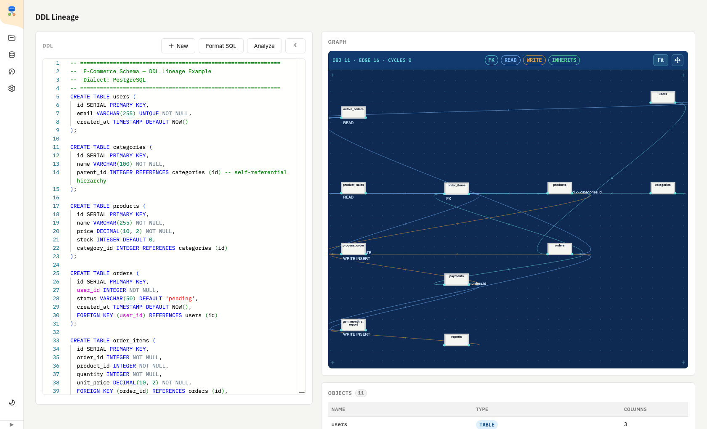
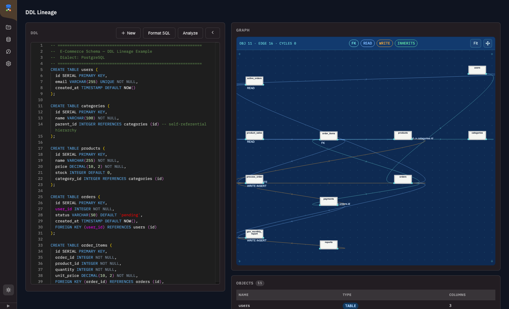
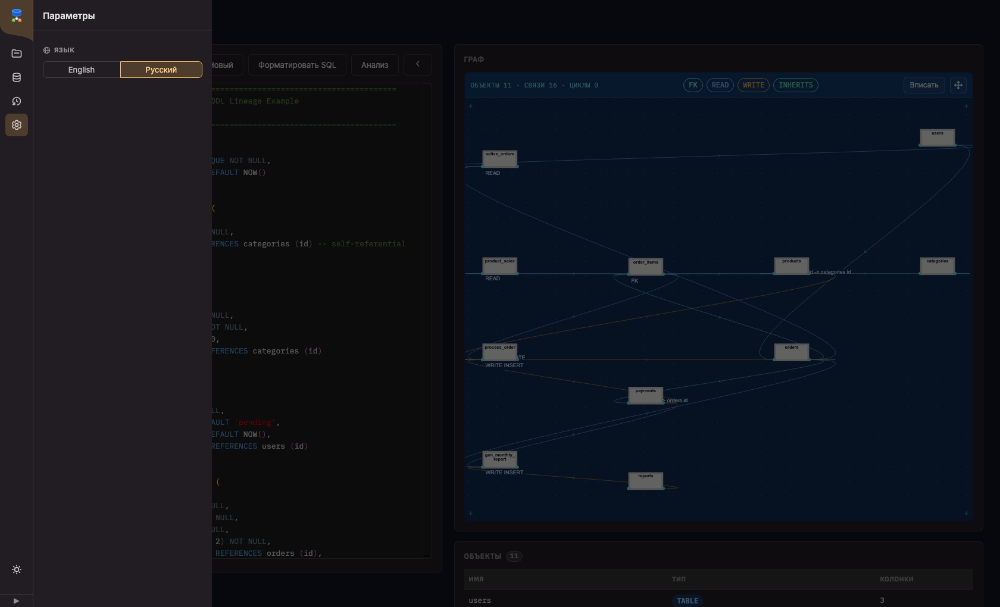
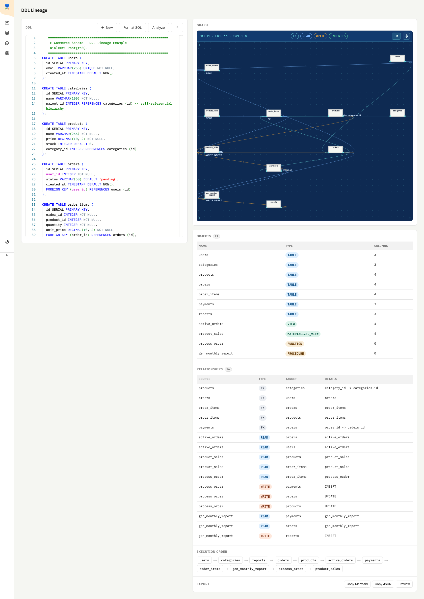

# DDL Lineage Analyzer  v2.0

> Extract **data lineage** from SQL DDL — tables, views, functions and stored procedures.

```
users ──[FK]──▶ orders ──[FK]──▶ order_items
                  │                   │
              [READ]              [READ]
                  ▼                   ▼
           active_orders        process_order ──[WRITE]──▶ payments
                                              ──[WRITE]──▶ orders
```

## Features

| Feature | Detail |
|---|---|
| **Table-level lineage** | FK, READ (FROM/JOIN), WRITE (INSERT/UPDATE/DELETE/MERGE/TRUNCATE), INHERITS |
| **Column-level lineage** | Parses `INSERT INTO t(c1,c2) SELECT a,b FROM src` |
| **Impact analysis** | Upstream + downstream BFS for any object |
| **Cycle detection** | DFS — warns on circular view/function dependencies |
| **Topological sort** | Safe execution order of DDL objects |
| **Multi-dialect** | PostgreSQL, MySQL/MariaDB, SQLite, T-SQL, Oracle PL/SQL, BigQuery |
| **Multiple output formats** | plain text, JSON, Graphviz DOT, Mermaid |
| **Zero dependencies** | stdlib only (Python ≥ 3.10) |

---

## Installation

```bash
# From source
pip install -e .

# Development extras (pytest, ruff, mypy)
pip install -e ".[dev]"
```

---

## Quick Start

### Python API

```python
from ddl_lineage import DDLLineageAnalyzer

analyzer = DDLLineageAnalyzer()
result   = analyzer.analyze(open("schema.sql").read())

# Plain-text report
print(analyzer.to_text(result))

# Impact analysis
imp = analyzer.impact("orders")
print(imp.summary())
# Impact analysis: orders
# ============================================
#   Upstream   (depends on): users
#   Downstream (used by):    active_orders, order_items, payments, process_order

# Cycles
if result["stats"]["has_cycles"]:
    for cycle in result["cycles"]:
        print(" -> ".join(cycle))
```

### CLI

```bash
# Plain text
python -m ddl_lineage examples/ecommerce.sql

# Graphviz SVG
python -m ddl_lineage examples/ecommerce.sql -f dot | dot -Tsvg -o lineage.svg

# Mermaid
python -m ddl_lineage examples/ecommerce.sql -f mermaid

# JSON
python -m ddl_lineage examples/ecommerce.sql -f json -o lineage.json

# Impact analysis
python -m ddl_lineage examples/ecommerce.sql --impact orders

# Only report cycles (exits 1 if any found)
python -m ddl_lineage examples/ecommerce.sql --cycles

# Topological order
python -m ddl_lineage examples/ecommerce.sql --topo

# Read from stdin
cat schema.sql | python -m ddl_lineage -
```

---

## Result Schema

```jsonc
{
  "objects": [
    {
      "name": "orders",
      "type": "TABLE",           // TABLE | VIEW | MATERIALIZED_VIEW | FUNCTION | PROCEDURE
      "schema": "public",
      "columns": [
        { "name": "id",      "type": "SERIAL",      "pk": true,  "nullable": false },
        { "name": "user_id", "type": "INTEGER",     "pk": false, "nullable": false,
          "fk_to": "users.id" },
        { "name": "status",  "type": "VARCHAR(50)", "default": "pending" }
      ]
    }
  ],
  "edges": [
    { "source": "orders",        "target": "users",    "type": "FK" },
    { "source": "active_orders", "target": "orders",   "type": "READ" },
    { "source": "process_order", "target": "payments", "type": "WRITE",
      "details": "INSERT",
      "col_lineage": [
        { "src_table": "order_items", "src_col": "order_id",
          "tgt_table": "payments",    "tgt_col": "order_id", "via": "process_order" }
      ]
    }
  ],
  "col_lineage": [ ... ],   // flat list of all column mappings
  "cycles":      [],        // [[\"v_a\", \"v_b\", \"v_c\", \"v_a\"]]
  "topo_order":  ["users", "categories", "products", "orders", ...],
  "stats": {
    "total_objects": 9,
    "total_edges":   16,
    "has_cycles":    false
  }
}
```

---

## Edge types

| Type | Meaning |
|---|---|
| `FK` | Foreign key constraint (`REFERENCES`) |
| `READ` | Object reads from another via `FROM` / `JOIN` |
| `WRITE` | Object modifies another via `INSERT` / `UPDATE` / `DELETE` / `MERGE` / `TRUNCATE` |
| `INHERITS` | Table inheritance (`INHERITS(parent)` or `LIKE parent`) |

---

## Web Interface

A full interactive UI on top of the same analyzer — paste SQL or scan a live database, get an auto-laid-out lineage graph, browse objects/relationships/execution order, and export the result. Flask backend + React (Gravity UI) frontend, available in **English and Russian**.



| Feature | Detail |
|---|---|
| **Live lineage graph** | Pannable/zoomable graph of the parsed schema, colored by edge type, with an inline object/edge/cycle readout |
| **SQL editor** | Monaco-based editor with syntax highlighting and one-click formatting |
| **Database connections** | Scan a live PostgreSQL/MySQL database to extract its DDL directly, no manual copy-paste |
| **Projects & history** | Save named analyses, browse version history, diff any two versions |
| **Localization** | English / Russian, switchable from Settings — JSON-based language packs (`web/frontend/src/language/`), with additional languages registerable at runtime |
| **Export** | Copy as Mermaid or JSON |

<details>
<summary>More screenshots — dark theme, Russian localization, data tables</summary>
<br>

| Dark theme | Русский |
|---|---|
|  |  |



</details>

### Running it

```bash
cd web
pip install -r backend/requirements.txt
cd frontend && npm install && cd ..

python run.py   # starts the Flask API (:5001) and the React dev server (:3000)
```

See [`web/README.md`](web/README.md) for architecture details and the API reference.

---

## Project layout

```
ddl_lineage/
├── ddl_lineage/
│   ├── __init__.py       Public API exports
│   ├── __main__.py       python -m ddl_lineage entry point
│   ├── models.py         Data classes: DDLObject, LineageEdge, Column, ColumnLineage
│   ├── parser.py         SQL parsing utilities (dialect-agnostic)
│   ├── graph.py          Graph algorithms: cycles, impact, topo sort
│   ├── analyzer.py       DDLLineageAnalyzer — main class + output renderers
│   └── cli.py            CLI argument parsing
├── web/
│   ├── backend/          Flask API (analysis, DB connectors, project store)
│   ├── frontend/         React + Gravity UI single-page app (src/language/ holds i18n JSON packs)
│   └── run.py            Runs backend + frontend dev servers together
├── tests/
│   └── test_analyzer.py  Pytest test suite
├── examples/
│   ├── ecommerce.sql     Full e-commerce PostgreSQL schema
│   ├── cycles.sql        Circular dependency example
│   └── mysql_style.sql   MySQL / stored procedure example
├── docs/screenshots/      Web interface screenshots used in this README
├── pyproject.toml
└── README.md
```

---

## Running tests

```bash
pytest                          # all tests
pytest -v                       # verbose
pytest --cov=ddl_lineage        # with coverage
pytest tests/test_analyzer.py::TestImpactAnalysis  # single class
```

---

## Supported dialects

| Dialect | Features |
|---|---|
| **PostgreSQL** | Dollar-quoting, `SERIAL`, `INHERITS`, materialized views |
| **MySQL / MariaDB** | Backtick identifiers, `AUTO_INCREMENT`, `BEGIN…END` procedures |
| **SQLite** | Standard `REFERENCES` |
| **T-SQL (SQL Server)** | `IDENTITY`, `MERGE`, `AS BEGIN…END` |
| **Oracle PL/SQL** | `CREATE OR REPLACE`, `AS BEGIN…END`, `RETURN` |
| **BigQuery** | Standard SQL views and functions |

---

## License

MIT
