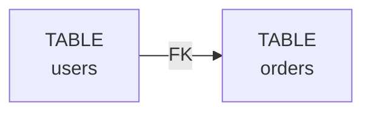

# 🎯 Web Interface Summary

Complete overview of the DDL Lineage Web Interface components.

## 📦 What's Included

### Core Files

| File | Purpose | Type |
|------|---------|------|
| `app.py` | Basic Flask application | Backend |
| `app_extended.py` | Extended Flask with file upload & export | Backend |
| `launcher.py` | Interactive launcher (choose basic/extended) | Utility |
| `utils.py` | Helper functions for results & analysis | Utility |
| `config.py` | Configuration settings | Config |

### Frontend Files

| File | Purpose |
|------|---------|
| `templates/index.html` | Main HTML interface |
| `static/css/style.css` | Styling & responsive design |
| `static/js/app.js` | Client-side JavaScript logic |

### Configuration & Deployment

| File | Purpose |
|------|---------|
| `requirements.txt` | Python dependencies |
| `Dockerfile` | Docker image definition |
| `docker-compose.yml` | Docker Compose setup |
| `run.sh` | Bash startup script |
| `.gitignore` | Git ignore rules |

### Documentation

| File | Purpose |
|------|---------|
| `README.md` | Web interface documentation |
| `INSTALLATION.md` | Detailed installation guide |
| `API.md` | API reference documentation |
| `SUMMARY.md` | This file - overview of components |

---

## 🚀 Getting Started

### 1️⃣ Fastest Way (30 seconds)

```bash
cd web
python app.py
```

Open: http://127.0.0.1:5000

### 2️⃣ Interactive Launcher

```bash
cd web
python launcher.py
```

Choose between basic or extended version.

### 3️⃣ Using Shell Script

```bash
cd web
bash run.sh
```

### 4️⃣ Docker

```bash
docker-compose -f web/docker-compose.yml up
```

---

## 🏗️ Architecture

```
┌─────────────────────────────────────────────┐
│         🌐 Web Browser (Frontend)           │
│  ┌────────────────────────────────────────┐ │
│  │  HTML + CSS + JavaScript (Bulma)       │ │
│  │  • SQL Input Panel                     │ │
│  │  • Results Display                     │ │
│  │  • Mermaid Diagram Visualization       │ │
│  └────────────────────────────────────────┘ │
└────────────────┬────────────────────────────┘
                 │ HTTP/AJAX
                 ▼
┌─────────────────────────────────────────────┐
│      🔧 Flask Backend (app.py)              │
│  ┌────────────────────────────────────────┐ │
│  │  REST API Endpoints                    │ │
│  │  • POST /api/analyze                   │ │
│  │  • POST /api/impact/<name>             │ │
│  │  • POST /api/topo                      │ │
│  │  • POST /api/upload                    │ │
│  │  • POST /api/export                    │ │
│  │  • GET  /api/health                    │ │
│  └────────────────────────────────────────┘ │
└────────────────┬────────────────────────────┘
                 │ Python API
                 ▼
┌─────────────────────────────────────────────┐
│   📊 DDL Lineage Analyzer (ddl_lineage/)    │
│  ┌────────────────────────────────────────┐ │
│  │  • parser.py - SQL parsing             │ │
│  │  • analyzer.py - Main analysis         │ │
│  │  • graph.py - Graph algorithms         │ │
│  │  • models.py - Data structures         │ │
│  └────────────────────────────────────────┘ │
└─────────────────────────────────────────────┘
```

---

## 🎨 User Interface Features

### Main Components

1. **SQL Input Panel** (Left)
   - Text area for SQL entry
   - Buttons: Analyze, Clear, Export
   - Tab-based results view
   - Pre-loaded SQL examples

2. **Statistics View**
   - Total objects count
   - Total edges count
   - Cycles detection
   - Schema validation status

3. **Objects List**
   - Table/View/Function/Procedure breakdown
   - Column details with constraints
   - Type badges and icons

4. **Visualization Area** (Right)
   - Mermaid diagram (interactive)
   - Table view (sortable edges)
   - Cycle information
   - Topological sort order

---

## 🔌 API Endpoints

### Analysis
- `POST /api/analyze` - Analyze SQL and get lineage

### Graph Operations
- `POST /api/impact/<object>` - Impact analysis
- `POST /api/topo` - Topological sort

### Data Management
- `POST /api/upload` - Upload SQL file
- `POST /api/export` - Export results
- `GET /download/<file>` - Download exported file

### Health
- `GET /api/health` - Service status

See [API.md](API.md) for complete reference.

---

## 📊 Supported Dialects

- PostgreSQL
- MySQL / MariaDB
- SQLite
- T-SQL (SQL Server)
- Oracle PL/SQL
- BigQuery

---

## 💾 Result Export Formats

### JSON
Machine-readable format for integration:
```json
{
  "objects": [...],
  "edges": [...],
  "cycles": [...],
  "stats": {...}
}
```

### Mermaid
Diagram syntax for visualization:


### Text Report
Human-readable format:
```
DDL LINEAGE ANALYSIS REPORT
...
STATISTICS
Total Objects:  5
Total Edges:    8
```

---

## 🔒 Security Considerations

### For Development
- Debug mode enabled
- No authentication required
- Accept requests from localhost only

### For Production
- [ ] Set `FLASK_ENV=production`
- [ ] Disable debug mode
- [ ] Use strong secret key
- [ ] Add authentication
- [ ] Enable HTTPS
- [ ] Run behind reverse proxy
- [ ] Rate limiting
- [ ] Input validation
- [ ] CORS configuration
- [ ] Update dependencies

See [INSTALLATION.md](INSTALLATION.md) for security checklist.

---

## 📈 Performance

| Metric | Value |
|--------|-------|
| Max upload size | 16 MB (configurable) |
| Typical analysis | < 1 second |
| Memory per analysis | ~50 MB |
| Concurrent users | 10-20 (dev mode) |

For production use Gunicorn with multiple workers.

---

## 🛠️ Customization

### Change Port
```bash
python -c "from app import app; app.run(port=8080)"
```

### Change Theme
Edit `web/static/css/style.css`

### Add Custom Endpoints
Edit `web/app.py` or `web/app_extended.py`

### Modify Examples
Edit `web/static/js/app.js` - `loadExample()` function

---

## 📚 Documentation

| Document | Content |
|----------|---------|
| [README.md](README.md) | Overview & features |
| [INSTALLATION.md](INSTALLATION.md) | Setup instructions |
| [API.md](API.md) | API reference |
| [SUMMARY.md](SUMMARY.md) | This file |

---

## 🧪 Testing

### Manual Testing

1. Open http://127.0.0.1:5000
2. Click "Analyze" with example SQL
3. Check diagram renders
4. Click export buttons
5. Try impact analysis

### API Testing

```bash
# Health check
curl http://127.0.0.1:5000/api/health

# Analyze
curl -X POST http://127.0.0.1:5000/api/analyze \
  -H "Content-Type: application/json" \
  -d '{"ddl": "CREATE TABLE t (id INT);"}'
```

---

## 🚀 Deployment Options

### Local Development
```bash
python app.py
```

### Production with Gunicorn
```bash
gunicorn -w 4 -b 0.0.0.0:5000 web.app:app
```

### Docker
```bash
docker-compose -f web/docker-compose.yml up -d
```

### Cloud Services
- Heroku
- AWS Elastic Beanstalk
- Google Cloud Run
- Azure App Service

---

## 📞 Support & Troubleshooting

### Common Issues

**Port already in use:**
```bash
python -c "from app import app; app.run(port=5001)"
```

**Import errors:**
```bash
export PYTHONPATH="${PYTHONPATH}:$(pwd)/.."
python app.py
```

**Flask not installed:**
```bash
pip install -r requirements.txt
```

See [INSTALLATION.md](INSTALLATION.md) for more solutions.

---

## 📋 Checklist for Production

- [ ] Requirements installed
- [ ] Flask running on port 5000
- [ ] Web interface loads
- [ ] Example SQL works
- [ ] Analyze button functional
- [ ] Diagram displays
- [ ] Export works
- [ ] No console errors
- [ ] API endpoints responding
- [ ] Security hardened

---

## 🎉 Features Showcase

### ✨ Highlights

- ⚡ Real-time SQL analysis
- 📊 Interactive Mermaid diagrams
- 🔍 Impact analysis (upstream/downstream)
- 🔄 Cycle detection
- 📋 Topological sort
- 📥 File upload support
- 📤 Multiple export formats
- 🎨 Responsive UI
- 🐳 Docker ready
- 🔧 Configurable & extensible

---

## 📖 Next Steps

1. **Try it out**: Run `python app.py`
2. **Read API docs**: See [API.md](API.md)
3. **Customize UI**: Edit CSS/JS
4. **Deploy**: Follow [INSTALLATION.md](INSTALLATION.md)
5. **Integrate**: Build custom tools on top

---

## 📜 License

MIT License - See LICENSE file in root directory

---

## 🤝 Contributing

Found a bug or have a feature request?

1. Test and document the issue
2. Create a GitHub issue
3. Submit a pull request
4. Follow Python coding standards

---

## 📞 Contact

For questions, issues, or suggestions:
- Open a GitHub issue
- Check existing documentation
- Review API examples

---

**Enjoy visualizing your SQL lineage! 🚀**
